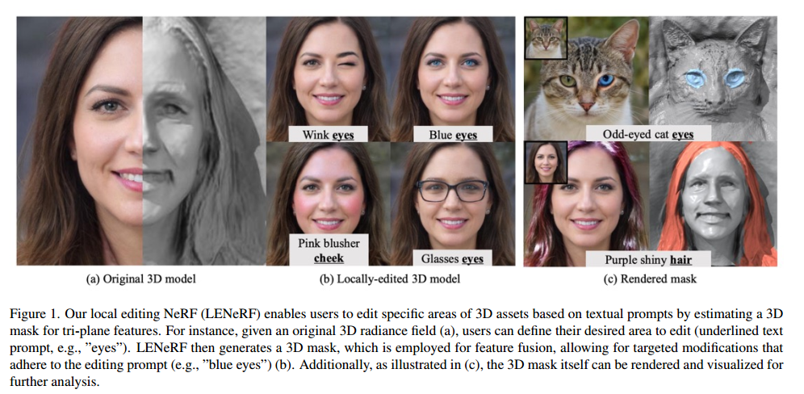
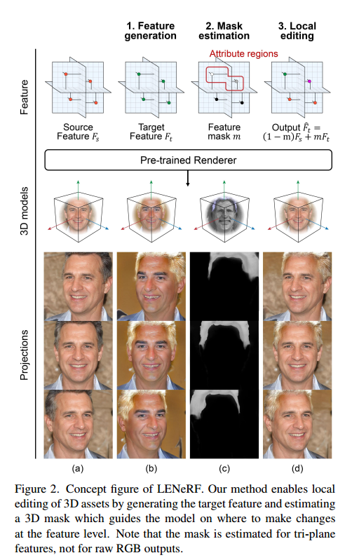
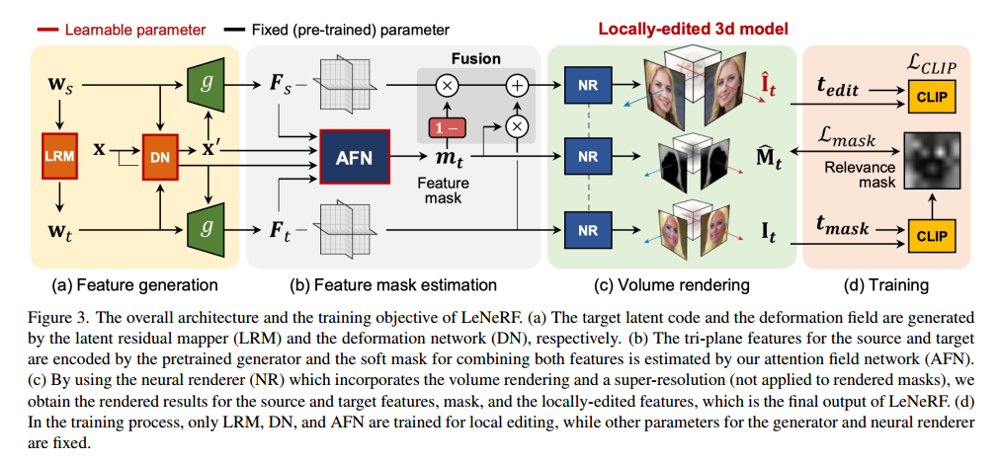
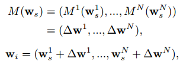
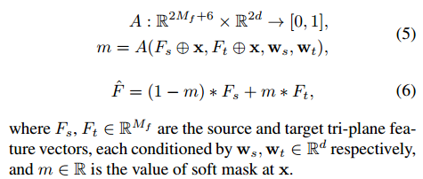

# Local 3D Editing via 3D Distillation of CLIP Knowledge

## 1. Motivations & Arguments & Contributions
本文提出了一种在预训练好的EG3D的基础上添加额外的部件实现NeRF编辑的方法。输入信息为文本表示的属性，以及文本表示的编辑区域。  

#### Arguments
（1）基于显式的3D表示比如voxel和mesh的生成和编辑，空间消耗大且编辑的结果缺少真实性  
（2）现有的NeRF编辑方法的缺陷：2D 引导对于 3D 编辑来说并不理想，并且缺乏细粒度编辑所需的描述性。此外，这些方法需要inversion，并且难以跨不同领域推广，因为它们依赖于语义mask标记。

#### Contributions
（1）本文提出了LENeRF，一种仅用文本信息就可以实现的NeRF编辑方法  
（2）本文的方法包含了add-on modules，不需要额外的域信息的标记，具有更好的泛化性。  
（3）本文提出了一种新的基于CLIP的蒸馏损失。  
（4）实验证明本文方法的有效性

## 2. Methodology

总体流程如图所示。整体基于EG3D，原来的隐变量为 $w_s$，Latent Residual Mapper(LRM)模块将其转变为编辑后的隐变量 $w_t$。x为三维空间坐标，Deformation Network(DN)建立空间点的形变的映射关系。Attention Field Network(AFN)模块生成mask来得到要编辑的区域，从而保证编辑后的场景结果在无关区域不变。

#### 2.1 Latent Residual Mapper(LRM)
利用本文设计的CLIP损失来约束，LRM输出的结果是StyleGAN2中，每个卷积部分对应的w的偏移量。

#### 2.2 Attention Field Network(AFN)
AFN的作用是根据输入信息中的编辑区域得到相应的区域的mask。  

#### 2.3 Deformation Network
额外用一个网络来建立场景的形变信息。于是AFN得到mask的式子5就要写成以下形式：  

## 3. Experiments
